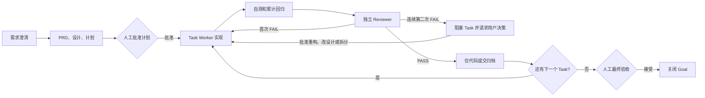

# Delivery Loop

`delivery-loop` 是一个把需求讨论推进为可恢复、可审查、可归档的软件交付闭环。它适合需要多人或多智能体协作、存在实现风险、并希望每个阶段都留下验证证据的开发工作。

它不是项目管理工具的替代品：重点是把一次实际开发过程约束为“计划确认 → 实现 → 自测与回归 → 独立 Review → 代码提交 → 最终验收”。

## 适用场景

- 一个需求尚不够清晰，需要先沉淀 PRD、技术设计和可执行计划。
- 改动需要拆成多个可独立验证、可独立提交的任务。
- 需要 Worker 实现、Reviewer 独立审查，并保留每轮审查结论。
- 需要中断后继续，并能判断任务到底做到哪里。
- 需要把“测试通过”与“需求语义正确”分开验证。

不建议用于：

- 单文件、低风险、无需规划的一行修复。
- 只读代码评审、排障结论或资料调研。
- 已经完全界定、只需一次性提交的小修复。

## 核心流程



一个 Goal 对应一次完整需求交付；Task 是其中可以独立实现、审查和提交的最小单元。小需求可以只有一个 Task；较大的需求应拆成多个有明确依赖关系的 Task，并以 `plan.md` 作为大任务的具体执行计划。

## 文档与提交如何组织

新 Goal 默认使用手工维护的 v8 `code_only` 模式：

- `state.json` 是唯一活动状态源；其中的 checkpoint 明确记录当前 Task、下一责任方、下一动作和恢复证据。
- 交付文档、状态和 Review artifact 保存在项目本地的 delivery 根目录，用于恢复和审计。
- 每个 Task 的 Git 提交只包含代码、测试和必要的运行时配置；不包含 `docs/delivery/**`。
- 每个 Task 完成后，将 Git 提交的精确文件清单与 `state.json` 的 archive manifest 对照，防止把无关改动或交付文档误提交。
- 默认不会推送、部署、执行 DDL 或调用其他会改变外部状态的操作。

这使代码历史保持干净，但本地交付文档默认不会随代码提交跨机器同步。需要长期共享审计材料时，应明确把 delivery 文档纳入团队文档库或另行归档。该 skill 不需要 Python、额外依赖或状态脚本：Agent 按 `SKILL.md` 中的手工状态转换表直接维护 `state.json`。既有的旧版状态不自动迁移；需要继续时，应先人工核对证据或新建 Goal。

推荐目录采用小写命名，并让不同 Goal 使用不同根目录，避免状态文件和 Review artifact 相互覆盖：

```text
docs/delivery/<goal-id>/
├── prd.md
├── design.md
├── plan.md
├── state.json
├── tasks/
│   └── task-001.md
└── reviews/
    └── task-001/round-01.md
```

## 最佳实践

1. 先定边界，再写代码。计划中明确目标、非目标、验收标准、风险和每个 Task 的依赖；计划未经人工批准，不进入实现。
2. 按“可独立归档”拆 Task。一个 Task 应有单一责任、可验证的验收标准和独立代码提交。仅因文件多而拆分没有价值。
3. 先定义证据。每个 Task 开始前写清自测、累计回归和 Review 需要证明什么；不能只以编译通过代替需求验证。
4. 保持审查独立。每一轮必须使用新的只读 Reviewer。首次 FAIL 只允许一次有界修复；连续两轮 FAIL 必须阻塞 Task 并请求用户选择重构、改设计或拆分，不能自动再开 Worker。
5. 直接维护状态，不手工“猜状态”。先读 checkpoint，再完成它的唯一下一动作，最后记录新事实和新 checkpoint。中断前、等待前和交接前都必须保存 checkpoint 并提示用户；恢复只处理有唯一证据支撑的状态。
6. 严格暂存代码清单。归档前只暂存本 Task 的代码/测试/运行时配置，并将 `git show --name-only <commit>` 的结果与 `archive_files` 对照；不要把日志、临时文件、用户已有改动或 delivery 文档混入提交。
7. 每个 Task 都做累计回归。后续 Task 除了自身自测，还要回归已完成 Task 的关键路径，防止“局部绿、整体退化”。
8. 保留人工决策点。人工至少确认计划、范围或高风险取舍，以及最终验收；推送、部署、数据库写入等外部操作仍需单独确认。

## 在 Codex 中使用

将 Skill 安装在 Codex 可发现的 skills 目录后，在新任务的第一条消息显式调用它，并一次说清交付边界。推荐模板：

> 使用 `$delivery-loop` 实现“支持按日期范围查询构建缓存命中率”。先输出 PRD、技术设计和 Task 计划，等我批准后再实现；每个 Task 要有自测、独立 Review、累计回归和本地代码提交。不要推送、部署或执行 DDL。

推荐按以下节奏协作：

1. 先让 Codex 只完成需求澄清与计划，并停在“等待批准计划”。
2. 审阅 `prd.md`、`design.md`、`plan.md` 后，明确回复“批准计划”。
3. 让它逐个执行 Task；每个 Task 的 Worker、Reviewer、回归和代码提交完成后，再启动下一个。任何停顿都会留下 checkpoint，说明下一责任方和下一动作。
4. 任务中断、切换会话或需要继续时，给出 Goal 根目录，并说“使用 delivery-loop 恢复这个 Goal”；它会先检查 `execution_context`、checkpoint、`state.json` 与 Git，再继续，而不是重做已经归档的 Task。
5. 最后检查汇总的行为变更、代码提交、验证证据和残余风险；确认后明确回复“验收通过”。推送、PR、发布等仍需要单独授权。

如果希望限制一次工作的范围，可以在 prompt 中追加：`只执行 TASK-002；不要修改 state 以外的交付文档；不要创建远端操作。` 不要只说“继续”，因为它无法表达本轮是否允许实现、验收或发布。


## 常见误区

- 把 Reviewer 当成第二个 Worker：Reviewer 应只读、独立判断，不能边审边改。
- 将“测试全绿”视为交付完成：Review 应专门检查边界、数据完整性、错误路径和兼容性。
- 在连续第二次 FAIL 后继续自动修复：这会制造死循环；此时必须阻塞并请求用户选择重构、改设计或拆分。
- 只报告“正在处理”而不写 checkpoint：这会让中断变成猜测；每次停顿必须留下下一责任方、下一动作和恢复证据。
- 在提交后才整理证据：测试命令、Review artifact 和 manifest 应在归档前完整存在。
- 把所有需求写进一个超大 Task：这会让回归、审查和回滚失去边界。

执行细节与强制约束以 [`SKILL.md`](SKILL.md) 为准；本 README 用于帮助使用者判断何时使用、如何组织和如何避免常见流程问题。
