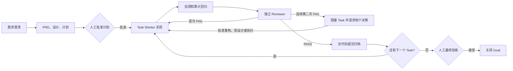

# Delivery Loop

`delivery-loop` 是一个把需求讨论推进为可恢复、可审查、可归档的软件交付闭环。它适合需要多人或多智能体协作、存在实现风险、并希望每个阶段都留下验证证据的开发工作。

它不是项目管理工具的替代品：重点是把一次实际开发过程约束为“计划确认 → 实现 → 自测与回归 → 独立 Review → 代码提交 → 最终验收”。

> 使用声明：这是一个工作流约束 skill，不替代人工判断或仓库规则；它不会自动授权推送、部署、数据库写入或其他外部变更。

## 适用场景

- 一个需求尚不够清晰，需要先沉淀 PRD、技术设计和可执行计划。
- 改动需要拆成多个可独立验证、可独立提交的任务。
- 需要 Worker 实现、Reviewer 独立审查，并保留每轮审查结论。
- 需要中断后继续，并能判断任务到底做到哪里。
- 需要把“测试通过”与“需求语义正确”分开验证。

不建议用于：

- 单文件、低风险、无需规划的一行修复。
- 只读代码评审、排障结论或资料调研。
- 已经完全界定、只需一次性提交的小修复。

## 核心流程



一个 Goal 对应一次完整需求交付；Task 是其中可以独立实现、审查和提交的最小单元。小需求可以只有一个 Task；较大的需求应拆成多个有明确依赖关系的 Task，并以 `plan.md` 作为大任务的具体执行计划。

## 文档与提交

每个 Goal 使用独立的 `docs/delivery/<goal-id>/` 目录。`state.json` 是唯一活动状态源，checkpoint 说明谁该做下一步、做什么、从哪里恢复。

```text
docs/delivery/<goal-id>/
├── prd.md · design.md · plan.md · state.json
├── tasks/task-<nnn>.md        # 仅 decomposed mode
└── reviews/task-<nnn>/round-<nn>.md
```

- 交付文档和 Review artifact 留在本地；代码提交只含代码、测试与运行时配置。
- 归档前，将 Git 提交的文件清单与 `archive_files` 对照；不提交 `docs/delivery/**`。
- 默认不推送、不部署、不执行 DDL。需要长期共享交付材料时，另行归档到团队文档库。

执行细节与强制约束以 [`SKILL.md`](SKILL.md) 为准；本 README 用于帮助使用者判断何时使用、如何组织和如何避免常见流程问题。

## License

This project is licensed under the [MIT License](LICENSE).
