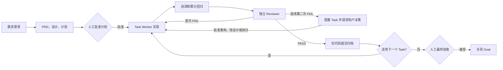

# Delivery Loop

`delivery-loop` 是一个把需求讨论推进为可恢复、可审查、可归档的软件交付闭环。它适合需要多人或多智能体协作、存在实现风险、并希望每个阶段都留下验证证据的开发工作。

它不是项目管理工具的替代品：重点是把一次实际开发过程约束为“计划确认 → 实现 → 自测与回归 → 独立 Review → 代码提交 → 最终验收”。

> 使用声明：这是一个工作流约束 skill，不替代人工判断或仓库规则；它不会自动授权推送、部署、数据库写入或其他外部变更。

## 适用场景

- 一个需求尚不够清晰，需要先沉淀 PRD、技术设计和可执行计划。
- 改动需要拆成多个可独立验证、可独立提交的任务。
- 需要 Worker 实现、Reviewer 独立审查，并保留每轮审查结论。
- 需要中断后继续，并能判断任务到底做到哪里。
- 需要把“测试通过”与“需求语义正确”分开验证。

不建议用于：

- 单文件、低风险、无需规划的一行修复。
- 只读代码评审、排障结论或资料调研。
- 已经完全界定、只需一次性提交的小修复。

## 核心流程

一个 Goal 对应一次完整需求交付；Task 是其中可以独立实现、审查和提交的最小单元。小需求可以只有一个 Task；较大的需求应拆成多个有明确依赖关系的 Task，并以 `plan.md` 作为大任务的具体执行计划。

## 文档与提交

每个 Goal 使用独立的 `docs/delivery/<goal-id>/` 目录。`state.json` 是唯一活动状态源，checkpoint 说明谁该做下一步、做什么、从哪里恢复。

- 交付文档和 Review artifact 留在本地；代码提交只含代码、测试与运行时配置。
- 归档前，将 Git 提交的文件清单与 `archive_files` 对照；不提交 `docs/delivery/**`。
- 默认不推送、不部署、不执行 DDL。需要长期共享交付材料时，另行归档到团队文档库。

## 最佳实践

1. 先批准计划：写清目标、非目标、验收标准和回滚边界，再开始实现。
2. 一次只推进一个可独立归档的 Task；每个 Task 都要有自测、累计回归和独立 Review。
3. 只信证据：先生成评审产物或代码提交，再更新 `state.json`；归档只暂存本 Task 的代码文件。
4. 先读 checkpoint 再继续。中断、等待或交接前更新它；连续第二次 FAIL 必须阻塞并请求用户决定，不自动重试。

## 在 Codex 中使用

将 Skill 安装在 Codex 可发现的 skills 目录后，在新任务的第一条消息显式调用它，并一次说清交付边界。推荐模板：

> 使用 `$delivery-loop` 实现“支持按日期范围查询构建缓存命中率”。先输出 PRD、技术设计和 Task 计划，等我批准后再实现；每个 Task 要有自测、独立 Review、累计回归和本地代码提交。不要推送、部署或执行 DDL。

推荐按以下节奏协作：

1. 先让 Codex 只完成需求澄清与计划，并停在“等待批准计划”。
2. 审阅 `prd.md`、`design.md`、`plan.md` 后，明确回复“批准计划”。
3. 让它逐个执行 Task；每个 Task 的 Worker、Reviewer、回归和代码提交完成后，再启动下一个。任何停顿都会留下 checkpoint，说明下一责任方和下一动作。
4. 任务中断、切换会话或需要继续时，给出 Goal 根目录，并说“使用 delivery-loop 恢复这个 Goal”；它会先检查 `execution_context`、checkpoint、`state.json` 与 Git，再继续，而不是重做已经归档的 Task。
5. 最后检查汇总的行为变更、代码提交、验证证据和残余风险；确认后明确回复“验收通过”。推送、PR、发布等仍需要单独授权。

如果希望限制一次工作的范围，可以在 prompt 中追加：`只执行 TASK-002；不要修改 state 以外的交付文档；不要创建远端操作。` 不要只说“继续”，因为它无法表达本轮是否允许实现、验收或发布。

## 常见误区

- 把 Reviewer 当成第二个 Worker：Reviewer 应只读、独立判断，不能边审边改。
- 将“测试全绿”视为交付完成：Review 应专门检查边界、数据完整性、错误路径和兼容性。
- 在连续第二次 FAIL 后继续自动修复：这会制造死循环；此时必须阻塞并请求用户选择重构、改设计或拆分。
- 只报告“正在处理”而不写 checkpoint：这会让中断变成猜测；每次停顿必须留下下一责任方、下一动作和恢复证据。
- 在提交后才整理证据：测试命令、Review artifact 和 manifest 应在归档前完整存在。
- 把所有需求写进一个超大 Task：这会让回归、审查和回滚失去边界。

执行细节与强制约束以 [`SKILL.md`](SKILL.md) 为准；本 README 用于帮助使用者判断何时使用、如何组织和如何避免常见流程问题。

## License

This project is licensed under the [MIT License](LICENSE).
